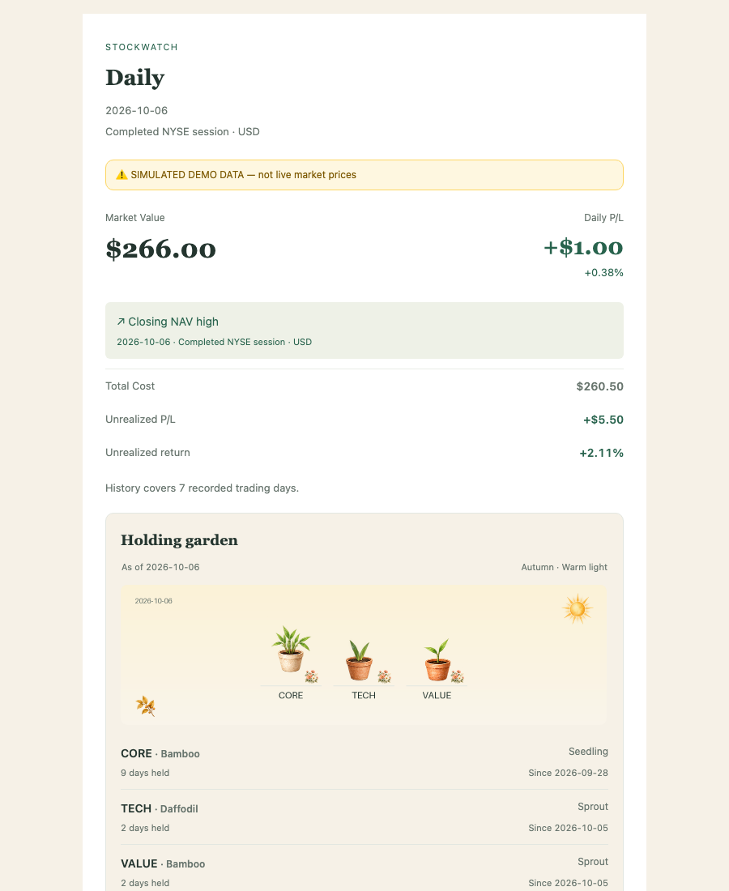
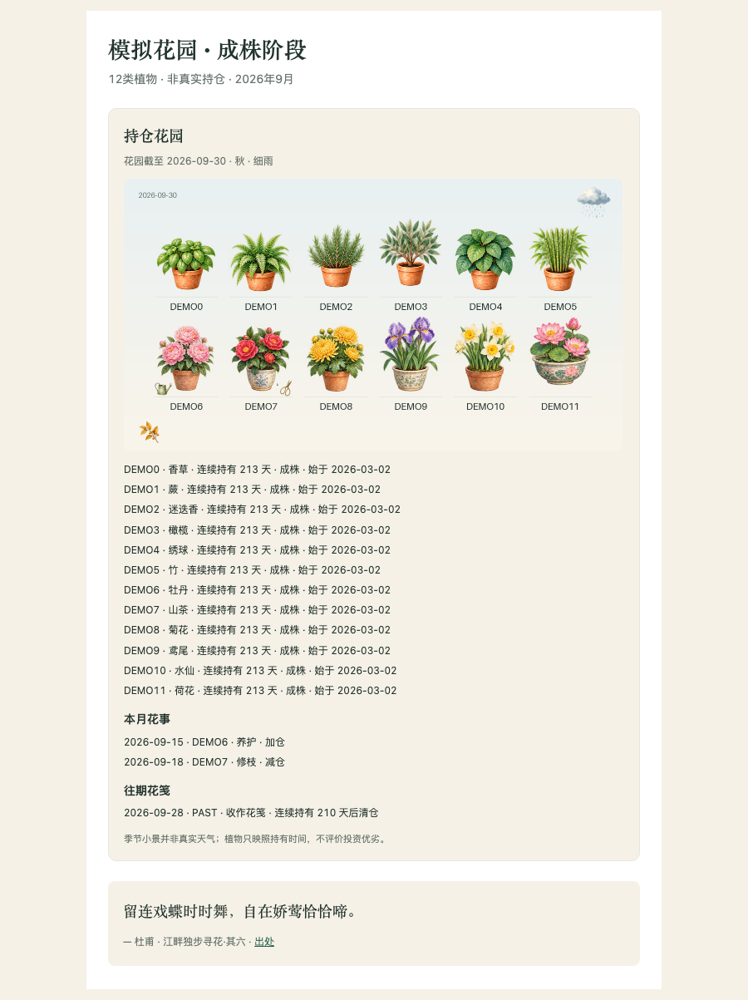

<div align="center">

# StockNest

**A lightweight, privacy-first US stock & ETF tracker that emails your portfolio every trading day — powered entirely by free GitHub Actions.**

[](https://www.python.org/downloads/)
[](https://streamlit.io/)
[](https://openbb.co/)
[](LICENSE)
[](https://github.com/YangChen-cn/stocknest/actions)
-orange?style=flat-square)

<a href="README.md"><b>English</b></a> • <a href="使用说明.md"><b>简体中文说明</b></a>


</div>

---

## What is this?

StockNest keeps a factual daily record of your US stock & ETF portfolio:

- **Automated email reports** — intraday brief and end-of-day summary sent to your inbox by GitHub Actions, with alerts, watchlist moves and a machine-readable JSON attachment. No server to keep running.
- **A local dashboard** (optional) — a Streamlit app on your own computer: holdings, performance vs. benchmark, watchlist, editable transaction ledger. Demo mode explores everything with synthetic data.
- **Free & file-based** — OpenBB/yfinance quotes, plain CSV/YAML/JSON storage, no database, no paid data provider, no brokerage connection, no auto-trading.
- **Bilingual** — every page and every email works in English or 简体中文.
- **Factual only** — reports contain your positions and the alerts you configured. No news, no ratings, no investment advice.

<div align="center">
<table><tr>
<td><sub>Performance vs. benchmark</sub></td>
<td><sub>Daily email report</sub></td>
</tr></table>
</div>

## Quick start: email reports only (no local commands needed)

The email pipeline runs completely on GitHub's free tier. Everything below happens in your browser.

> **Why private?** Your repo holds your real transactions and settings, and the report workflow only runs in private repositories. Free accounts include 2,000 Actions minutes/month — a daily report uses about 3–5.

**1. Create your own private repository.**
Click **Use this template** above the file list → create the repository, then open its **Settings → General → Danger Zone → Change visibility → Private**.

**2. Add three Secrets.**
In your repository: **Settings → Secrets and variables → Actions → New repository secret**

| Secret | Value |
| --- | --- |
| `GMAIL_ADDRESS` | The Gmail address that sends the reports |
| `GMAIL_APP_PASSWORD` | A Gmail [App Password](https://support.google.com/accounts/answer/185833) (requires 2-Step Verification; not your normal password) |
| `REPORT_EMAIL` | The inbox that receives the reports |

**3. Enter your settings and first trade.** Two files, both editable on github.com:

`config.yaml` — create it from [`config.example.yaml`](config.example.yaml). A minimal example:

```yaml
portfolio:
  base_currency: USD
  language: en                 # en / zh-CN
  benchmark: SPY               # any US ticker, price return
notifications:
  email_enabled: true
watchlist: {}                    # pure observation needs no targets or alerts
reports:
  INTRADAY: {enabled: true, time: "10:23", days: [0, 1, 2, 3, 4]}
  CLOSE: {enabled: true, time: "18:53", days: [0, 1, 2, 3, 4]}
```

`data/transactions.csv` — one line per trade, NYSE session dates:

```csv
date,symbol,side,shares,price,note,fee
2026-03-10,VTI,BUY,10,120.50,initial purchase,1.00
```

**4. Test run without sending.**
**Actions → StockWatch Daily → Run workflow** → mode `CLOSE`, keep **Dry run** checked → **Run workflow**. The run log ends with a one-line summary such as `Report generated for …: N holdings, N new alerts, 0 tickers unavailable`. Dry runs never send email and never change alert state.

**5. Go live.**
Run again with **Dry run** unchecked — the report lands in `REPORT_EMAIL`. Scheduled runs are already built in: **10:23** (intraday brief) and **18:53** (closing report), US Eastern, Monday–Friday, holidays skipped. Only want the closing email? Set `INTRADAY: {enabled: false}` in `config.yaml`. Times are approximate (GitHub schedules can drift a few minutes); see below for exact-time scheduling.

That's it. From now on your repo maintains itself: each report run persists alert state and performance history back to your repository.

## Optional: local dashboard

```sh
git clone https://github.com/YangChen-cn/stocknest.git && cd stocknest
python3.11 -m venv .venv && source .venv/bin/activate
python -m pip install -r requirements.lock && python -m pip install --no-deps -e .
streamlit run app.py --server.address 127.0.0.1
```

Open `http://127.0.0.1:8501`. First run creates `config.yaml` and an empty `data/transactions.csv` for you; toggle **Demo mode** in the sidebar to explore offline first. The dashboard binds to localhost only and has no built-in authentication — it is not meant to be exposed directly to the internet.

<div align="center">
<table><tr>
<td><sub>Watchlist &amp; alerts</sub></td>
<td><sub>Mobile layout</sub></td>
</tr></table>
</div>

## Optional: hosted dashboard (Streamlit Community Cloud)

Deploy your **private** repo to [Streamlit's free hosting](https://share.streamlit.io) and check your portfolio from any browser, even with your computer off. The hosted app runs read-only by default (one `STOCKWATCH_READONLY` secret), falls back to a market snapshot committed by the Actions runs when Yahoo is unreachable, and can optionally allow watchlist/notes edits with a dedicated GitHub token. Full guide: [docs/cloud-dashboard.md](docs/cloud-dashboard.md).

## Optional features

| Feature | What it does | Where |
| --- | --- | --- |
| HSBC execution import | Reads fully-executed USD trade confirmations from Gmail (read-only IMAP), deduplicated by trade ID | [使用说明 · 自动导入汇丰成交](使用说明.md) |
| Weekly / monthly summaries | Saturday / first-weekend-day reports with period returns, flows and fees | Enable in `reports:` config, run manually via Actions, or automate below |
| cron-job.org scheduler | Exact New York trigger times and weekly/monthly automation (GitHub's own schedule stays fixed-time) | [使用说明 · cron-job.org 外部自动调度](使用说明.md) |
| AI-readable JSON | Every email carries a versioned JSON block + attachment; dashboard exports a live snapshot | [使用说明 · 用 GPT / Gmail 分析日报](使用说明.md) |
| macOS login startup | Auto-start the local dashboard at login via launchd | [使用说明 · 本机 Gmail 与登录自启](使用说明.md) |

## A holding garden and seasonal letters



Each holding has a watercolor plant from 12 botanical families, including six flowers. Five stages follow **calendar days in the current holding cycle**; adding shares does not reset its age. New positions plant seedlings, additions leave watering marks, partial sales leave pruning marks, and closed holdings appear in that period’s weekly/monthly botanical notes. Flowering varieties naturally bloom as they mature; separate flower ornaments commemorate strictly verified closing portfolio NAV highs.

Daily reports carry a small inline garden; weekly/monthly reports include period events and growth milestones. The dashboard garden is folded below the holdings table. Warm light, gentle rain and clouds reflect the relevant portfolio return; missing data stays neutral and plants remain healthy during declines. Seasonal decorations are illustrative, not real weather. Each page/report includes one sourced Chinese or English classical extract, alternating by report date, with a reading note when needed.

Everything is composed offline from the existing ledger, loaded prices and matching history. No extra quote requests, garden state, notifications or changes to financial JSON. If images cannot render, the written garden remains readable. See [使用说明](使用说明.md) for the exact growth boundaries and behavior.

## How the numbers are computed

- **Average cost**: buy fees join the cost basis; partial sales realize `proceeds − sell fee − removed cost`; fees are never deducted twice. This is not tax-lot accounting.
- **Flow-adjusted performance**: buys are treated as contributions and net sales as withdrawals — invested cash is never mistaken for profit. Daily return `= (end value + net sales) / (previous value + buys) − 1`, compounded into an index starting at 100 (buys at day start, sales at day end — a stated daily approximation).
- **Honest windows**: 5D spans five NYSE sessions (six closes); monthly/yearly windows roll back the calendar to the session on or before the boundary. Missing data shows as unavailable — never zero-filled, never bridged. A relevant stock split blocks historical calculation instead of inventing adjustments.
- **Benchmark**: split-adjusted **price** return of any US ticker you choose. Dividends, idle cash, XIRR, taxes and corporate actions are excluded.

The full methodology (in Chinese, matching every formula in the code) is in [使用说明.md](使用说明.md).

## Privacy model

- `config.yaml`, `data/` (transactions, alert state, performance history) are **ignored by Git** in this public repo. Real data belongs only in your own **private** repository.
- The report workflow refuses to run in public repositories, and the dashboard's sync feature verifies privacy before pushing anything.
- Reports carry facts and your configured alerts — no credentials, no broker data, no advice. The AI JSON attachment explicitly excludes secrets, addresses and your full trade ledger.

## Development

```sh
python -m pytest        # offline suite: fake providers, fake SMTP, temp git repos
python -m pip check
python -m stockwatch.daily --demo --dry-run   # offline preview with synthetic data
```

`ci.yml` runs tests on push/PR. `daily.yml` handles schedules, state persistence and recovery artifacts; report runs skip holidays and early closes, retry missing closes up to three times, and isolate per-ticker failures. Architecture notes live in the module docstrings; release history in [docs/releases](docs/releases).

## Honest limitations

- Free Yahoo data can be delayed, missing or rate-limited; failed tickers are reported, never zero-filled.
- GitHub's native schedule is not exact-time delivery; cron-job.org integration adds precision but is still not a guarantee.
- SMTP and Git are not atomic; a crash between sending and persisting can re-send once. Recovery artifacts are kept for three days.
- This project records and reports. It does not advise.

## License

[AGPL-3.0](LICENSE)
