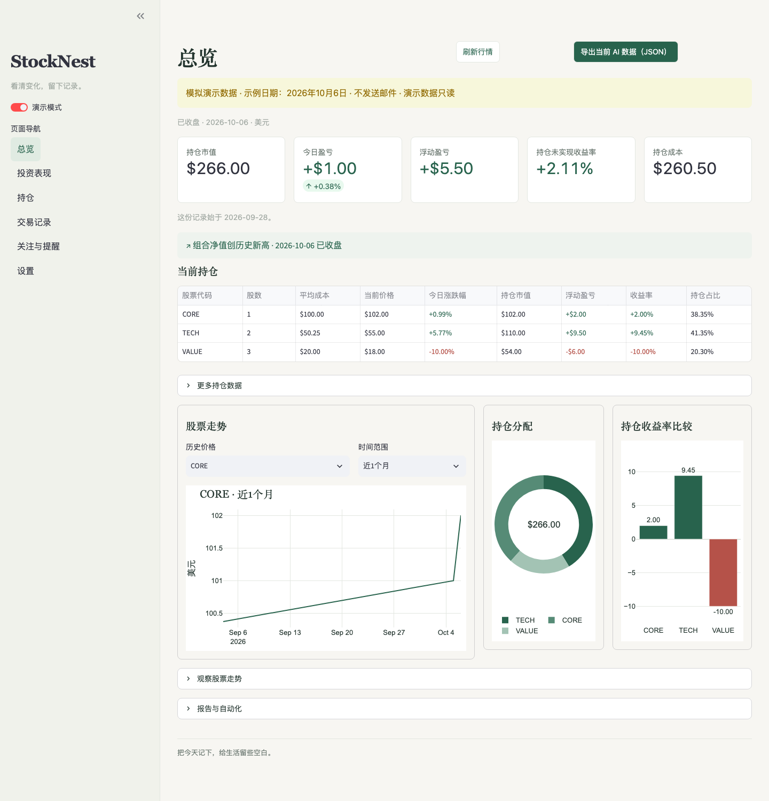
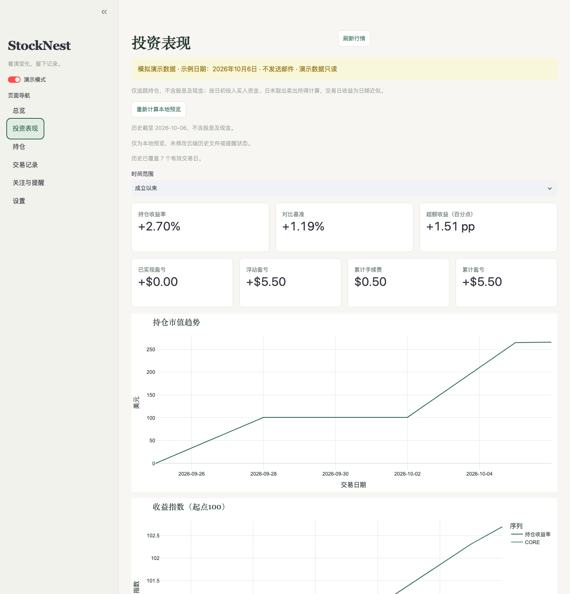
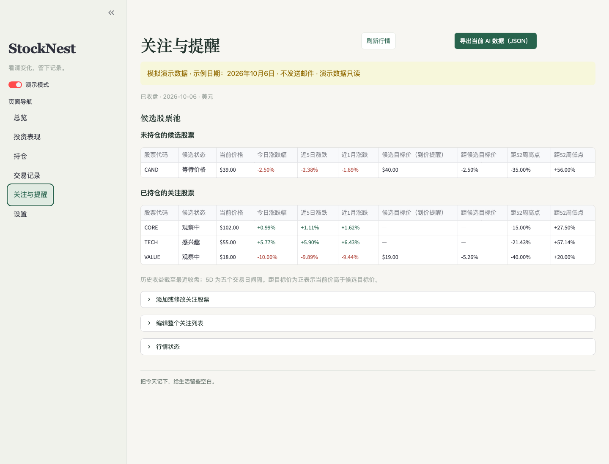
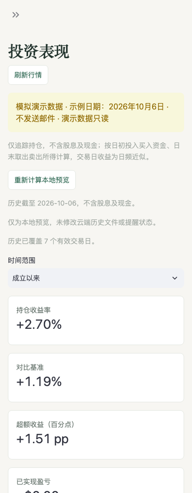

# StockNest

<p align="left">
  <a href="https://www.python.org/downloads/"></a>
  <a href="https://streamlit.io/"></a>
  <a href="https://openbb.co/"></a>
  <a href="LICENSE"></a>
  <a href="https://github.com/YangChen-cn/stocknest/actions"></a>
  
</p>

<p align="left">
  <b>English</b> | <a href="使用说明.md">简体中文说明</a>
</p>

---

**StockNest** is the public edition of StockWatch, a small personal US stock/ETF tracker: OpenBB + free yfinance data, a local Streamlit dashboard, and optional Gmail reports through GitHub Actions. No brokerage connection, automatic trading, database server or paid provider.

The dashboard is branded StockNest. Internal Python commands, report subjects and workflow names retain `stockwatch` / StockWatch for compatibility with private copies; the core implementation is shared.



---

## Start locally

Python 3.11 is the tested baseline.

```sh
git clone https://github.com/YangChen-cn/stocknest.git
cd stocknest
```

```sh
python3.11 -m venv .venv
source .venv/bin/activate
python -m pip install -r requirements.lock
python -m pip install --no-deps -e .
streamlit run app.py --server.address 127.0.0.1
```

Open `http://127.0.0.1:8501` and enable **Demo mode** to explore without network requests or email. `CORE`, `TECH`, `VALUE` and `CAND` are fictional symbols; all demo trades/prices are synthetic. Demo files are read-only.

The app creates an empty `config.yaml` from `config.example.yaml` and an empty `data/transactions.csv` on first use. Both are ignored by Git. To prepare them manually:

```sh
cp config.example.yaml config.yaml
mkdir -p data
cp examples/transactions.example.csv data/transactions.csv
```

Use **Transactions** in the dashboard to search by company name/ticker and enter **your own** trade date, shares, execution price and optional fee. Dates use NYSE trading sessions. Do not copy synthetic demo symbols into your real watchlist. Settings supports English/Chinese and a configurable benchmark, default `SPY`.

### Transactions CSV Format (`data/transactions.csv`)

| date | symbol | type | shares | price | fee | notes |
| :--- | :--- | :--- | :--- | :--- | :--- | :--- |
| `2026-03-10` | `NVDA` | `BUY` | `10` | `120.50` | `1.00` | Initial purchase |
| `2026-03-15` | `AAPL` | `BUY` | `20` | `185.00` | `0.00` | Core holding |
| `2026-03-20` | `NVDA` | `SELL` | `5` | `135.00` | `1.00` | Partial take profit |

*Legacy 6-column CSV files remain fully compatible (`fee` defaults to 0).*

---

## What it does

- **Dashboard / Holdings**: costs, price, daily movement, unrealized P/L, portfolio allocation weights and price charts.
- **Watchlist & Alerts**: pure observation needs no price target or alert. Targets/alerts are optional; all watched stocks appear in a compact closing summary. Intraday emails include only notable moves, near targets and triggered alerts.
- **Performance**: historical market value, cash-flow-adjusted index, benchmark comparison, average-cost realized P/L and fees.
- **Settings / Control Center**: local email switch, existing `gh` login for workflow status/manual dispatch/enable/disable, optional macOS login startup.



### Performance & Return Calculation

- **Cash Flow Accounting**: Buys count as capital contributions; net sales count as withdrawals. No idle cash account is tracked.
- **Daily Return Formula**:
  $$\text{Daily Return} = \frac{\text{End Value} + \text{Net Sales}}{\text{Previous Value} + \text{Buy Cost}} - 1$$
  Compounded daily into a money-weighted index starting at $100$.
- **Approximations**: Buys are assumed at day start and sales at day end, so trade-day returns are daily approximations. Buy costs include fees; sale proceeds exclude fees.
- **Realized P/L**: Uses the **Average Cost** method, not tax lots. Fees are deducted exactly once.
- **Data Integrity & Windows**:
  - **5D** spans five NYSE sessions, using six closing prices.
  - **1M / 1Y** windows roll back calendar months and choose the trading session on or before the boundary.
  - Histories use completed closes and exact anchors. Missing data leaves gaps; relevant splits block historical calculation rather than inventing share adjustments.
  - Benchmark uses **price** return. Dividends, taxes, automatic corporate actions and XIRR are excluded.

---

## Watchlist & UI Showcase





---

## Reports and Gmail

```sh
# Completely offline: no email or personal state changes
python -m stockwatch.daily --demo --dry-run

# Live closing preview after configuring your own local files
python -m stockwatch.daily --dry-run

# Inspect/rebuild historical performance without changing tracked history
python -m stockwatch.daily --rebuild-performance --dry-run
```

Normal reports read `GMAIL_ADDRESS`, `GMAIL_APP_PASSWORD`, `REPORT_EMAIL` from environment variables. Gmail requires an [App Password](https://support.google.com/accounts/answer/185833); never write it into YAML, CSV or a commit. Missing settings skip sending. Disabling `notifications.email_enabled` still generates reports/history and leaves alerts pending. SMTP failures preserve reports and do not consume notifications.

Only **CLOSE** writes `data/performance.json`; **INTRADAY** reads the previous close. Alert state is separate per mode. Repeated successful reports for the same session/mode skip email unless forced. Dry-run/demo never change personal state/history. Outputs, logs and user data are ignored.

---

## GitHub Actions: use a private personal copy

> [!WARNING]
> The **public source repository does not run portfolio automation**. CI checks shared code in the public repository. `daily.yml` explicitly skips public repositories because logs/artifacts could reveal personal portfolio information. Do not enable portfolio automation in a public fork or commit real data there.

For personal automation, create a **private** repository from this clean source (GitHub template if available, or import/push the source to a new private repository). Change `origin` to that private repository. Confirm its visibility in GitHub Settings. Once verified private, intentionally track your personal inputs in that private copy:

```sh
# Only in your verified PRIVATE repository
# gh auth login uses existing GitHub CLI credentials; the app stores no token.
gh auth login
gh api repos/YOUR_ACCOUNT/YOUR_PRIVATE_REPO --jq '.private'
# Continue only when the result is true.
git add -f config.yaml data/transactions.csv
git commit -m "chore: configure personal portfolio"
git push origin main
```

The UI sync button also checks GitHub repository privacy before committing. It commits only config/transactions/import audit (never local Gmail), pulls remote history/state, and preserves conflicts. A source checkout without a GitHub origin shows unavailable cloud controls and remains usable locally.

Add three repository Secrets: `GMAIL_ADDRESS`, `GMAIL_APP_PASSWORD`, `REPORT_EMAIL`.

- **Workflow dispatch**: Actions → StockWatch Daily → Run workflow supports `CLOSE` / `INTRADAY`, dry-run, force resend and performance rebuild.
- **Scheduled runs**: America/New_York at **10:30** and **19:00** weekdays; NYSE calendar gates holidays, weekends, early closes and incomplete sessions. GitHub scheduling can be delayed.
- **CI & Runtime**: CI runs pytest and pip checks separately. Daily jobs use `requirements-runtime.lock` without Streamlit, Plotly or pytest.
- **State Persistence**: In a private copy only, the bot commits state/performance and, when HSBC imports exist, transactions/import audit with `[skip ci]`, using `contents: write`, concurrency and no force push.
- **Crash Recovery**: Three-day private artifacts contain logs and recovery files. If sending succeeds but pushing fails, restore the affected artifact state/history/transactions/import audit before rerunning to avoid duplicate mail.

---

## Close-data checks and HSBC execution imports

### Close-Data Retry Engine

CLOSE checks all configured holdings/watchlist quotes for the target NYSE session and a valid previous close before delivery. Missing or stale quotes cause up to **three checks, two minutes apart** (`--close-attempts 1..3`, `--close-retry-seconds 60..180`).

No partial daily report is sent during this wait. Exhaustion sends one error notification per session and exits nonzero; price alerts and the regular report remain pending. A later run can send the recovered report. Dry-run/demo and runs without active email settings do not wait or send error mail. Insufficient 5D/1M history can still show unavailable without blocking a current, otherwise complete report. Runner waiting time counts towards Actions minutes; the workflow has a bounded 45-minute timeout.

### HSBC Execution Sync (Optional)

HSBC HK email import is optional and disabled in `config.example.yaml`. Enable **HSBC execution sync** in Settings, or configure:

```yaml
imports:
  hsbc:
    enabled: true
    allow_email_date: true
    lookback_days: 3
```

- **Authentication & Parsing**: The importer uses read-only Gmail IMAP and the existing `GMAIL_ADDRESS` / `GMAIL_APP_PASSWORD` credentials. Only the supported Traditional Chinese **fully executed** USD confirmation format is accepted, with Gmail DKIM/DMARC authentication, matching reference/symbol/side, zero remaining quantity and matching current/cumulative quantities.
- **Trade Date Fallback**: If a trade date is absent, the default uses the email Date converted to America/New_York and records that estimate. Delayed emails can therefore need manual date correction; disable `allow_email_date` to skip them instead. Non-session dates are never guessed. Fees absent from email default to zero and should be checked manually.
- **Execution & Re-runs**: Both scheduled modes sync before calculating the portfolio. **Sync HSBC executions now** reads locally when Gmail variables exist; otherwise it dispatches the private workflow with `sync_only=true`, without sending a report.

```sh
python -m stockwatch.daily --sync-only --dry-run  # read and preview; no writes/mail
python -m stockwatch.daily --sync-only            # import only; no report/mail
python -m stockwatch.daily --skip-hsbc --dry-run  # no Gmail access
```

- **Deduplication**: Trade IDs are retained in CSV notes as `[HSBC:ID]` and in ignored `data/hsbc_imports.json`. Repeated reads do not duplicate entries; manually deleted/changed entries are not silently restored.

---

## Optional local Gmail and login registration

Cloud email uses the private repository's GitHub Actions Secrets. Local Gmail is optional; an unconfigured local profile says nothing about cloud health. **Check cloud Gmail Secrets** lists Secret names only and never reads or writes their values.

Dashboard and Settings provide a collapsed **Advanced: optional local Gmail** form for Gmail Address, Report Email and App Password. A blank recipient defaults to the sender; a blank password retains an existing saved local password. Saving sends no test mail. Remove the profile to stop using it; existing environment variables remain in effect and always take precedence.

Local credentials are plaintext in `.stockwatch/gmail.json`, atomically written with mode 0600 in a 0700 directory, ignored by Git and excluded from Git Sync. They only supply local SMTP / read-only HSBC access for this checkout. Passwords are never prefilled and the input is cleared after saving.

---

## Search, holding notes and page responsiveness

- **Search & Selection**: Stock search runs when a changed name/ticker is submitted with Enter or focus leaves the input, with a search button for retries. New results replace the previous selection instead of retaining an unrelated ticker. Only the selected instrument's latest available price, daily move, 52-week range and quote date are requested. Quotes are reference information, never automatically treated as execution prices; selecting a different symbol resets the execution price and fee fields.
- **Holding Thesis / Notes**: Holdings provides editable thesis/notes, even when empty. Notes preserve existing watchlist settings and do not require targets/alerts. Nonempty holding notes appear in both text/HTML emails; blank notes are omitted and HTML is escaped. Holdings/Dashboard price charts list current holdings only; pure watched stocks live on Watchlist & Alerts.
- **On-Demand Fetching**: Dashboard/Holdings request holdings and opening-position prices only, avoiding unused candidate quotes. The candidate pool reuses the same provider's already-fetched daily history for 5D/1M analytics.

### Closed-market dashboard cache

Outside an active NYSE session, Dashboard and Watchlist reuse validated daily bars in ignored `.cache/market/`. The cache survives page changes and app restarts and expires when a newer completed NYSE session exists. Missing/stale closes or previous closes are fetched again, never presented as current data. Regular-session prices retain a five-minute memory cache. **Refresh market data** clears the UI market cache and forces another request; the first load of a new session still needs the free provider. Daily reports do not read this UI cache.

Only the public StockNest repository runs CI for shared code. Private StockWatch CI stays disabled to conserve private Actions minutes; daily automation remains separately controlled.

### AI-readable email data

The original HTML report remains visually unchanged. Every report also ends with a versioned JSON block between `STOCKWATCH_DATA_V1_BEGIN` and `STOCKWATCH_DATA_V1_END`: hidden in HTML, retained in the plain-text MIME alternative. The same JSON is also attached as UTF-8 `application/json`, named `stockwatch-YYYY-MM-DD-close.json` or `stockwatch-YYYY-MM-DD-intraday.json` (errors use `-error.json`).

Schema `stockwatch.report` version 1 includes report mode/session/timezone, timestamp, USD holdings/cost/P&L, all available instrument prices and dates, watchlist 5D/1M values, optional user thesis and targets, pending alerts, and compact historical portfolio/benchmark returns with their cutoff. Monetary/share/percentage values are decimal strings; percentages use percentage points and unavailable values are `null`.

> **Example AI Prompt**:  
> *"Read the JSON attachment of my latest StockWatch report (fall back to the STOCKWATCH_DATA_V1 block in the full plain-text MIME part if needed), compare it with the previous report, and explain price changes, data gaps and configured alerts. Distinguish user notes from market facts and compare only compatible modes/dates."*

### Export a current snapshot for AI

On Dashboard or Watchlist & Alerts, click **Export current AI data (JSON)** to download `stockwatch-YYYY-MM-DD-MODE-snapshot.json`. It shares the email schema and uses already-loaded prices, holdings, optional notes and matching local history. It does not send mail, request extra market data, evaluate alerts or write portfolio/state/history files. Refresh prices first if needed.

### Intraday watchlist highlights

The visible INTRADAY body includes up to three watch-only stocks whose absolute daily change reaches **5%**. Rows show the current snapshot price, signed daily change and New York price time, ordered by movement magnitude with ticker tie-breaking. No target price or alert is required. Held stocks stay in Holdings; invalid/stale quotes are excluded.

---

## macOS startup (`launchd`)

No service is enabled automatically. Register next-login startup while the current Dashboard continues running:

```sh
python -m stockwatch.control install
python -m stockwatch.control status
python -m stockwatch.control start
python -m stockwatch.control stop
python -m stockwatch.control uninstall
```

Settings offers login registration and managed-service stop/removal controls; the Dashboard does not offer a start-service button. This per-user launchd service starts the local-only Dashboard **after login**, not email jobs. Stopping it disconnects the page; use the terminal to start again. The generated plist is in `~/Library/LaunchAgents/`; logs stay in ignored `logs/`.

---

## Privacy and development

`.gitignore` excludes local config, all `data/`, Secrets, environments, reports, logs and caches. Do not use `git add -f` for personal files in a public repository. Never publish private screenshots, workflow artifacts or an existing private repository's history. This release starts from a new Git root commit, not a clone of personal history. See [public-release checks](PUBLIC_RELEASE_CHECK.md).

```sh
# Run comprehensive tests
python -m pytest

# Validate dependencies
python -m pip check

# Public release safety scan
python tools/check_public_release.py
```

Tests use synthetic data, fake providers/SMTP and temporary Git repositories; no live Gmail/Yahoo is required. Core code lives in `stockwatch/` and is identical in public/private editions. Keep this source as the upstream; private copies retain their own tracked data.

---

## License

This project is licensed under the [GNU AGPL-3.0-only](LICENSE). Dependencies retain their own licenses; consult the pinned package metadata.
